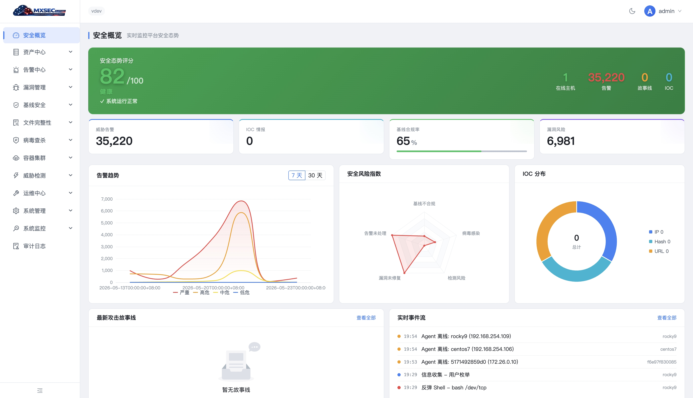
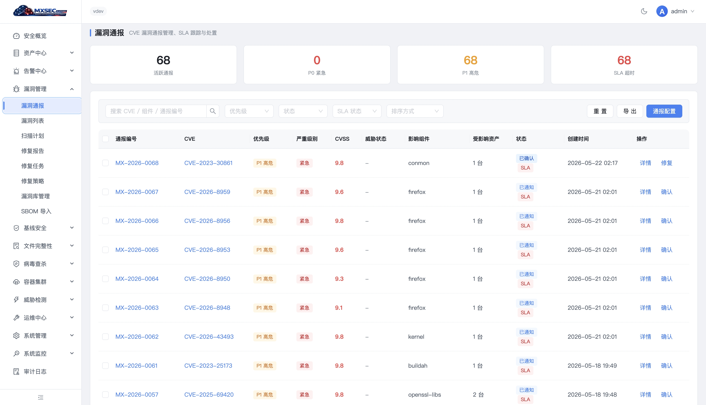
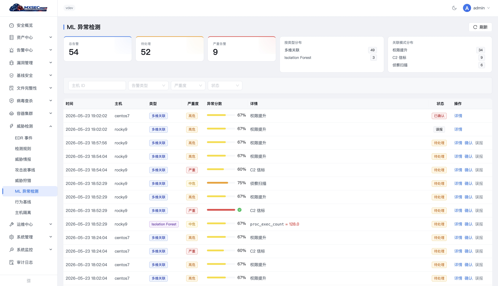

# mxsec — Industrial-grade Open-source CWPP for Linux & Kubernetes

> **mxsec — 工业级开源 CWPP，专精 Linux 与 Kubernetes**

**English | [中文](README_ZH.md)**

[](https://github.com/imkerbos/mxsec-platform)
[](LICENSE)
[](https://github.com/imkerbos/mxsec-platform/stargazers)
[](https://github.com/imkerbos/mxsec-platform/issues)
[](https://github.com/imkerbos/mxsec-platform/commits/main)
[](https://goreportcard.com/report/github.com/imkerbos/mxsec-platform)

---

## 一、产品定位 / Positioning

**mxsec 是一款工业级开源 CWPP（Cloud Workload Protection Platform），专精 Linux 主机与 Kubernetes 容器**，面向 ToB 政企、金融、互联网客户的生产环境工作负载安全。

- **覆盖范围**：物理机 / 虚拟机 / 容器 / Pod / K8s 节点 — 全部 Linux 生态
- **不做**：Windows 工作站、macOS、Unix 小机（AIX / HP-UX / Solaris）、端点 EDR、旁路 NDR
- **架构**：**六微服务 + Kafka 异步解耦 + Agent/Plugin 数据面**
- **目标**：让客户**看清家底，算清风险，处清事件，默认不打挂业务，磨合后自动响应**

> *mxsec is a production-ready, open-source Cloud Workload Protection Platform focused on Linux hosts and Kubernetes containers. Built for enterprise security teams, mxsec follows an **observe-first** philosophy: it deploys in **detection-only mode by default** and graduates to **prevention mode** only after operational data proves the engine is well-tuned for the tenant's environment.*

---

## 二、三大产品目标 — 看清 → 算清 → 处清

mxsec 把安全运营的全周期闭环压缩为**对客户最直白的三段产品语言**，每段对齐 NIST CSF：

| 目标 | 关键设问 | NIST CSF | 核心交付 |
|------|---------|----------|---------|
| **① 看清（Visibility）** | "我这里有什么？谁在跟谁说话？" | Identify + Detect | 22+ 类资产清点 / 南北东西向流量 / 态势大屏 |
| **② 算清（Insight）** | "我这里风险在哪？暴露面多大？" | Identify + Detect（脆弱性） | 漏洞 / 基线 / 运行时威胁 / 配置 / 弱口令 |
| **③ 处清（Response）** | "出事了怎么办？以后怎么不出事？" | Protect + Respond + Recover | 修复 Plan / 应急 Playbook / 复盘报告 |

> 三段递进，**缺一段即崩盘**：只看不算 = 巨型 SIEM 灯泡墙；只算不处 = 漂亮报表无落地；只处不看 = 全凭直觉乱扣机器。详见 [`docs/security-objectives.md`](docs/security-objectives.md)。

---

## 三、六微服务架构 / Six-Service Architecture

mxsec **不是三层架构**，而是**六微服务 + Kafka 异步解耦**。每个服务**只做一件事**，违反即设计错误。

```
                                    浏览器 / API / CI/CD
                                            |
                                            v
                                    Nginx (TLS + LB)
                                            |
   +-------------+--------------+-----------+-----------+-------------+--------------+
   |             |              |                       |             |              |
   v             v              v                       v             v              v
+--+------+ +----+------+ +-----+-------+         +-----+-----+ +-----+-----+ +------+----+
| Manager | | VulnSync  | | AgentCenter |         | Consumer  | |  Engine   | | LLMProxy  |
|---------| |-----------| |-------------|         |-----------| |-----------| |-----------|
| HTTP API| | 11 源漏洞 | | gRPC 接入   |         | Kafka→存储| | 检测分析  | | 多 LLM    |
| RBAC    | | advisory  | | 任务下发    |         | 幂等写入  | | CEL/ML    | | 适配/路由 |
| 业务编排| | 仲裁推送  | | Canary灰度  |         | DLQ       | | Storyline | | 缓存/审计 |
| 多租户  | |           | | 心跳/mTLS   |         | Sanitize  | | 告警生成  | | Fallback  |
+----+----+ +-----+-----+ +------+------+         +-----+-----+ +-----+-----+ +-----+-----+
     |            |              |                       |             |             |
     +------------+--------------+-----------+-----------+-------------+-------------+
                                             |
                          +------------------+------------------+
                          v                  v                  v
                     +--------+         +---------+      +-----------+
                     | MySQL  |         |  Redis  |      |ClickHouse |
                     | 业务   |         | SD/Cache|      | 事件归档  |
                     +--------+         +---------+      +-----------+
                                             ^
                                             |
                                       +-----+-----+
                                       |   Kafka   |
                                       | 10+ Topic |
                                       +-----+-----+
                                             ^
                                             | gRPC BiDi Stream + mTLS
                                             |
                          +------------------+------------------+
                          v                                     v
                  +-------+--------+                    +-------+--------+
                  |  mxsec-agent   |  ... N 主机/节点 ...|  mxsec-agent   |
                  | Linux Daemon   |                    | K8s DaemonSet  |
                  |----------------|                    |----------------|
                  | EDR/eBPF 内置  |                    | 容器富化       |
                  | baseline       |                    | K8s 节点视角   |
                  | scanner / fim  |                    |                |
                  | remediation    |                    |                |
                  | av-scanner     |                    |                |
                  | rasp (Java MVP)|                    |                |
                  +----------------+                    +----------------+
```

| 微服务 | 职责（only-one-thing） | 副本 |
|--------|----------------------|------|
| **Manager** | HTTP API + RBAC + 业务编排 + 报表 + 通知 + 多租户控制 | N 副本无状态 |
| **AgentCenter** | gRPC 接入 + 任务下发 + Canary 灰度 + 证书下发 + 心跳 | N 副本无状态 |
| **Consumer** | Kafka → MySQL / ClickHouse / Redis 幂等写入 + DLQ + Sanitize | N 副本 |
| **Engine** | CEL 规则 / 序列 / ML 推理 / Storyline / ATT&CK / 告警生成 | N 副本 CPU 密集 |
| **VulnSync** | 11 + 4 信创源漏洞 advisory 融合（NVD/OSV/RHSA/USN/...） | 单副本 Leader Election |
| **LLMProxy** | 统一 LLM 接口 + 多厂商路由 + 缓存 + Fallback + 计费（可选） | N 副本无状态 |

> 控制面**全部无状态、水平扩展**；数据面通过 Kafka 解耦写入与分析；Agent 端 CPU < 3%、RSS < 80MB。完整设计见 [`docs/architecture.md`](docs/architecture.md)。

---

## 四、监听优先 — 默认不打挂业务

> **产品哲学一句话**：先看清，再动手。

mxsec **默认部署即监听模式**（`MODE=observe`），仅产生告警与建议，**不执行任何阻断、隔离、kill、封禁等"动作类响应"**。平台在客户生产环境磨合 **≥ 90 天**、关键指标达标后，按 **租户 / 主机 / 规则** 三粒度灰度切换到防护模式（`MODE=protect`），开启自动响应。

```
observe（默认）   ──[6 门槛准入]── protect（防护）
 仅 audit/would_action    G1 数据沉淀 ≥ 90d
 零业务影响               G2 月度误报率 ≤ 2%
 数据磨合 + 模型校准      G3 告警准确率 ≥ 85%
                          G4 历史回放命中 ≥ 85%
                          G5 客户书面授权
                          G6 CanaryRollout 5%/25%/100% 就绪
```

为什么默认监听？— 因为"上来就阻断 = 业务被打挂 = 客户卸载"，工业级 CWPP（CrowdStrike Falcon / SentinelOne / Wazuh / Falco）**无一例外**默认 detect-only。完整哲学、切换门槛、灰度策略、`would_action` 告警 schema 见 [`docs/operating-modes.md`](docs/operating-modes.md)。

---

## 五、智能分析 — 本地 ML 主导 + LLM 可选

**用户可选三档独立开关**，UI 全局配置：

| 档位 | 配置 | 适用场景 |
|------|------|---------|
| **Baseline** | `ml=off, llm=off` | 离网 + 低配 + 不信任 AI |
| **Smart（默认推荐）** | `ml=on, llm=off` | 离网政企首选 |
| **AI-Native** | `ml=on, llm=on` | 有公网客户 |

- **本地 ML（主导）** — ONNX Runtime CPU 推理，10 个开源模型（IForest / LightGBM / MiniLM Embedding 等），实时检测全部本地完成，零外发。详见 [`docs/ml-models.md`](docs/ml-models.md)
- **LLM（可选）** — 多厂商统一适配（OpenAI / Anthropic / Gemini / Qwen / DeepSeek / Kimi / 智谱 / 火山 / Ollama / vLLM），租户级 token 预算 + 24h 缓存 + 主厂商失败 5min 黑名单 Fallback。详见 [`docs/llmproxy-design.md`](docs/llmproxy-design.md)
- **规则中台** — CEL 规则引擎 + Falco / Sigma / Tetragon Policies 自动转 CEL，详见 [`docs/falco-sigma-integration.md`](docs/falco-sigma-integration.md)

> **设计立意**：实时检测靠本地 ONNX 模型（毫秒级 + 离网可用），LLM 仅做语义增强（告警解释 / Storyline 总结 / 误报降权建议），可一键禁用。

---

## 六、多租户 from-day-1

mxsec **不是事后加多租户**，而是 from-day-1 全平台贯穿 `tenant_id`：

- **行级硬隔离** — 所有业务表 `tenant_id` 列 + GORM 中间件强制注入 + 默认 `NOT EXISTS` 防穿越
- **三段鉴权** — JWT 校验 → Tenant 校验 → RBAC 校验，缺一层即 401/403
- **三档隔离策略** — `shared`（共库共表，默认）→ `schema`（独立 schema）→ `db`（独立 DB 实例，KA 客户）
- **MSSP 父子租户** — 父租户 read-only 看子租户聚合，子租户独立运营
- **租户级配置覆盖** — `mode` / ML / LLM / 配额 / 保留期 / 通知 / 规则 全部租户级可覆盖

完整设计见 [`docs/multi-tenant.md`](docs/multi-tenant.md)。

### 租户类型

| 类型 | 适用 | 示例 |
|------|------|------|
| `standalone` | 普通客户，互不知晓 | 单一企业、独立部门 |
| `mssp_parent` | MSSP 服务商 / 集团总部 | 安全运营服务商、银行集团总部 |
| `mssp_child` | 子公司 / 客户实体 | 集团子公司、MSSP 客户租户 |
| `internal` | 平台自用 | mxsec 团队测试租户 |

### 三档物理隔离策略

| 策略 | DB | Kafka | 适用客户 |
|------|-----|-------|---------|
| **shared**（默认） | 共库共表 + `tenant_id` 行隔离 | 共享 Topic + Key=`{tenant}:{agent}` | 中小客户 / 互联网 |
| **schema** | 同实例独立 schema（`mxsec_t_bank_a.hosts`） | 独立 Topic | 中型政企 |
| **db** | 独立 MySQL / CK 实例 | 独立 Topic + 可选独立 Kafka 集群 | 金融 KA / 监管要求 |

迁移路径：`shared → schema → db` **单向迁移**，提供 `mxctl tenant migrate` CLI，迁移期间该租户写入暂停（API 返回 503），数据按 `tenant_id` 过滤 dump + restore。

---

## 七、快速开始 / Quick Start

### 环境要求

- Linux x86_64（推荐 RHEL/CentOS/Rocky 8+ / Ubuntu 20.04+ / Debian 11+）
- Docker 24+ 与 Docker Compose v2
- 内存 ≥ 8GB / 磁盘 ≥ 50GB（Demo 规模）

### 一键启动

```bash
git clone https://github.com/imkerbos/mxsec-platform.git
cd mxsec-platform/deploy

# 配置环境（必改：SERVER_IP / JWT_SECRET / 数据库密码）
cp .env.example .env
vim .env

# 启动控制平面（HA 模式 — 各服务 2 副本）
docker compose --env-file .env up -d \
  --scale manager=2 --scale agentcenter=2 --scale consumer=2

# 等待健康检查（约 1-2 分钟）
docker compose ps
```

浏览器访问 `http://<SERVER_IP>`，默认凭证 `admin / admin123`，**登录后立即修改**。

### 安装 Agent

```bash
# Manager UI → 资产中心 → 一键安装命令，复制到目标主机执行：
curl -sSL http://<SERVER_IP>/install/agent.sh | sudo bash
```

详细部署（生产集群 / K8s DaemonSet / 离网部署 / 备份恢复）见 [`docs/deployment.md`](docs/deployment.md)。

### 默认配置检查清单（部署前必做）

| 项 | 默认值 | 必改 | 说明 |
|----|--------|------|------|
| `SERVER_IP` | 127.0.0.1 | ✅ | Agent 回连入口，必须真实可达 |
| `JWT_SECRET` | (空) | ✅ | ≥ 32 字节随机串，泄露 = 全平台沦陷 |
| `MYSQL_ROOT_PASSWORD` | mxsec | ✅ | 生产环境换强密码 |
| `REDIS_PASSWORD` | (空) | ✅ | 生产环境必须设置 |
| `MODE` | observe | ❌ | 默认监听，不要改成 protect |
| `MULTI_TENANT_ENABLED` | true | ❌ | from-day-1 多租户，禁止关闭 |
| `LLM_ENABLED` | false | ❌ | 默认不开 LLM；如启用，需配置 provider 与 API Key |
| `ML_ENABLED` | true | ❌ | 本地 ML 默认开，离网可用，零外发 |

### 容量规划速查

| 档位 | Agent 数 | 推荐部署 | 关键参数 |
|------|---------|----------|---------|
| Demo | 100-500 | 单机 docker-compose | 8GB RAM / 50GB 盘 |
| 小规模 | 500-2k | 标准多副本（默认） | 16GB RAM × 3 节点 |
| 中规模 | 2k-10k | 扩 Kafka 分区 + CK 副本表 | 32GB RAM × 5 节点 + Kafka 6 broker |
| 大规模 | 10k-50k | + Kafka 多集群 + MySQL 主从异地 | 详见 deployment.md |
| 极限 | 50k-300k | + TiDB/Vitess + 独立 SD 服务 + Region Federation | M2 阶段 |

---

## 八、文档导航 / Documentation Map

### 架构与产品哲学

- [`docs/architecture.md`](docs/architecture.md) — **六微服务架构总图**（必读）
- [`docs/operating-modes.md`](docs/operating-modes.md) — **监听 / 防护双模式哲学**（必读）
- [`docs/multi-tenant.md`](docs/multi-tenant.md) — **多租户 from-day-1 设计**（必读）
- [`docs/security-objectives.md`](docs/security-objectives.md) — **看清 / 算清 / 处清 三大目标**

### 核心微服务设计

- [`docs/engine-design.md`](docs/engine-design.md) — Engine 检测引擎设计
- [`docs/engine-detection-design.md`](docs/engine-detection-design.md) — 检测细节（CEL / 序列 / ML）
- [`docs/vulnsync-design.md`](docs/vulnsync-design.md) — VulnSync 11 源融合
- [`docs/vuln-module-design.md`](docs/vuln-module-design.md) — 漏洞模块设计
- [`docs/llmproxy-design.md`](docs/llmproxy-design.md) — LLMProxy 多厂商适配

### Agent 与采集

- [`docs/edr-agent-design.md`](docs/edr-agent-design.md) — EDR Agent 采集设计
- [`docs/edr-engine-design.md`](docs/edr-engine-design.md) — EDR 引擎设计
- [`docs/edr-performance-tuning.md`](docs/edr-performance-tuning.md) — Agent 性能调优
- [`docs/asset-model.md`](docs/asset-model.md) — 资产统一模型

### 智能与规则

- [`docs/ml-models.md`](docs/ml-models.md) — 本地 ML 模型清单（ONNX）
- [`docs/falco-sigma-integration.md`](docs/falco-sigma-integration.md) — Falco / Sigma / Tetragon → CEL

### 运维与参考

- [`docs/deployment.md`](docs/deployment.md) — 部署指南
- [`docs/configuration.md`](docs/configuration.md) — 配置参考
- [`docs/api-reference.md`](docs/api-reference.md) — REST API 全集
- [`docs/datatype-allocation.md`](docs/datatype-allocation.md) — DataType 分配表
- [`docs/faq.md`](docs/faq.md) — 常见问题

### 治理与贡献

- [`docs/governance.md`](docs/governance.md) — 项目治理模型
- [`docs/contributing.md`](docs/contributing.md) — 贡献指南

---

## 九、项目状态 / Project Status

> mxsec 当前处于 **v2.0 重构进行中**：从 v1.x 三层架构（Manager / AC / Consumer）升级为**六微服务**，新增 Engine / VulnSync / LLMProxy 三个微服务，全平台引入 `tenant_id`、`observe/protect` 双模式、本地 ML。

| 阶段 | 范围 | 状态 |
|------|------|------|
| **Phase 0 — v1.x 既有架构** | Manager + AgentCenter + Consumer 三层 / 资产 / 基线 / 漏扫 / FIM / 病毒 / EDR / K8s CIS | ✅ 已上线（v1.x） |
| **Phase 1 — 微服务拆分 + 多租户骨架** | Engine / VulnSync / LLMProxy 三个微服务落地 + JWT/RBAC 加 tenant + GORM TenantScope + 所有业务表加 `tenant_id` | 🚧 进行中 |
| **Phase 2 — 监听 / 防护双模式 + 灰度** | `MODE=observe` 默认上线 + 6 门槛准入引擎 + CanaryRollout v2（5%/25%/100%）+ Engine `would_action` 字段 | 🚧 设计完成，开发中 |
| **Phase 3 — 智能分析双层** | 本地 ML 10 模型 + LLMProxy 9 厂商 + ml/llm 三档开关 UI + 规则中台（Falco / Sigma 转 CEL） | 📋 已规划 |
| **Phase 4 — 入侵检测六件套 + RASP + Anti-Rootkit** | 暴破 / 异常登录 / 反弹 shell / 提权 / 后门 / Web 后门 6 全 + Java RASP MVP + LKM Anti-Rootkit + AV 隔离箱 | 📋 已规划 |

> **图例**：✅ 已上线 / 🚧 进行中 / 📋 已规划

完整路线图与对标差距分析详见 [`docs/roadmap.md`](docs/roadmap.md)，内部商业化路线见 `ref/00-总体评估与商业化路线.md`。

### Phase 1 关键里程碑

| 里程碑 | 验收标准 |
|--------|---------|
| Engine 服务独立部署 | `cmd/server/engine/main.go` 入口可启动；ConsumerGroup `mxsec-engine` 订阅 5 个上行 Topic；CEL / 序列 / ML 三层均可产 alert 写 `mxsec.engine.alert` |
| VulnSync 服务独立部署 | 11 + 4 信创源全部跑通；advisory 写 `mxsec.vuln.advisory`；Engine 可基于主机指纹关联出 host_vulnerability alert |
| LLMProxy 服务独立部署 | OpenAI / Anthropic / Qwen / Ollama 4 个 provider 跑通；24h 缓存命中可观测；主厂商 fail 5min 黑名单 fallback 验证通过 |
| 多租户骨架落地 | JWT 含 `tenant_id` claim；GORM `TenantScope` 拦截裸查询；Casbin RBAC 含 tenant 维度；`/api/v2/admin/*` 平台超管 API 跑通 |
| Consumer 瘦身 | celengine / anomaly / storyline / siem 模块全部从 Consumer 删除，回归纯写入器；Consumer 单进程 CPU 下降 ≥ 30% |
| Manager 瘦身 | LLM 调用 / 漏洞同步 / K8s Audit 检测全部从 Manager 删除，仅保留业务编排 |

### Phase 2 关键里程碑

| 里程碑 | 验收标准 |
|--------|---------|
| `MODE=observe` 默认上线 | 新部署默认 `observe`；Banner 显示当前模式；所有动作类响应路径走 `mode-guard` 包装 |
| 6 门槛准入引擎 | G1-G6 全部可程序化校验；任一未达 → 拒绝切 protect；UI 显示"距离可切 protect 还差 X 天 / 误报率 Y%" |
| CanaryRollout v2 | 5% → 25% → 100% 三波灰度；失败自动回滚；演练 ≥ 1 次成功 |
| Engine `would_action` 字段 | observe 模式下 alert 必带 `would_action`；UI 显示"建议封禁 IP"按钮；点击走"用户主动响应"通道（鉴权 + audit） |

---

## 十、技术栈 / Tech Stack

| 层 | 技术选型 |
|---|---------|
| **后端** | Go 1.25+（Gin / gRPC / Gorm / Zap / Viper / JWT） |
| **前端** | Vue 3 + TypeScript + Pinia + Ant Design Vue 4 + Vite |
| **存储** | MySQL 8.0+（业务主数据）/ Redis 7（SD/缓存）/ ClickHouse 24（时序事件） |
| **消息** | Kafka KRaft 模式（10+ Topic + DLQ + 3 ConsumerGroup） |
| **监控** | Prometheus（主机指标唯一源） + 可选 Thanos / VictoriaMetrics |
| **ML 推理** | ONNX Runtime（CPU 推理） + scikit-learn 训练侧 |
| **通信** | gRPC 双向流 + mTLS + Protobuf + Snappy 压缩 |
| **部署** | Docker Compose（Demo）/ Systemd + Nginx（小规模）/ K8s（中大规模） |
| **打包** | nFPM（RPM / DEB） |

---

## 十一、支持的运行环境 / Supported Platforms

| 类别 | 支持 |
|------|------|
| **主机 OS** | Rocky Linux 8/9/10、Oracle Linux 7/8/9、CentOS 7/8/9、RHEL 8/9、Debian 10/11/12、Ubuntu 20.04/22.04/24.04、openEuler、Anolis、Kylin、UOS |
| **运行形态** | 物理机 / 虚拟机 / 容器宿主 / K8s 节点 / K8s 集群 |
| **容器运行时** | containerd、cri-o、cri-dockerd |
| **K8s 版本** | 1.24 ~ 1.30 |

**不支持**：Windows、macOS、AIX / HP-UX / Solaris、嵌入式 Linux（资源不足）。

---

## 十二、Community Edition vs Enterprise Edition

mxsec Community Edition 包含**完整平台框架与所有核心安全能力**，与商业版共享同一套架构（六微服务 + observe/protect + 多租户），免许可证、Apache 2.0 协议。

| 能力 | 社区版 | 商业版 |
|------|:------:|:------:|
| Linux 数据采集（eBPF） | ✅ | ✅ |
| Agent 控制面（升级 / 配置 / 任务） | ✅ | ✅ |
| 主机 / 容器状态与详情 | ✅ | ✅ |
| 22+ 类资产清点（含 K8s） | ✅ | ✅ |
| 主机 / 容器入侵检测 | 内置样例规则 | ✅ 完整规则库 |
| 运行时检测（eBPF + CEL） | 内置样例规则 | ✅ 完整规则库 |
| K8s Audit 入侵检测 | 内置样例规则 | ✅ 完整规则库 |
| 行为序列检测 | ❌ | ✅ |
| 告警白名单 / 聚合 / 溯源 | ✅ | ✅ |
| 威胁响应（kill / quarantine / network block） | ✅ | ✅ |
| 漏洞检测（OSV.dev + CVSS） | ✅ | ✅ |
| 漏洞情报热更新（11 + 4 信创源） | ❌ | ✅ |
| 基线检查（CIS Benchmark） | ✅ | ✅ |
| 基线一键修复 | ✅ | ✅ |
| 病毒扫描（ClamAV + YARA-X） | ✅ | ✅ |
| 文件完整性监控（FIM） | ✅ | ✅ |
| 威胁情报（MISP IOC） | ✅ | ✅ |
| 容器 CIS 基线（80 条） | ✅ | ✅ |
| 审计日志 | ✅ | ✅ |
| 组件管理 / 插件分发 | ✅ | ✅ |
| Prometheus 监控 | ✅ | ✅ |
| 运维巡检 / 报表导出 | ✅ | ✅ |
| 蜜罐 | ❌ | 🚧 规划中 |
| 主动防御 / 微隔离 v2 | ❌ | 🚧 规划中 |
| 云端杀毒（云查） | ❌ | 🚧 规划中 |
| MSSP 父子租户控制台 | ❌ | 🚧 规划中 |
| NPatch 虚拟补丁 | ❌ | 🚧 规划中 |

> **图例**：✅ 支持 / ❌ 不支持 / 🚧 规划中
>
> **声明**：mxsec 不规划 Windows / macOS 主机支持，定位严格限定 Linux + K8s。要构建更完整的安全运营体系，建议基于内置 CEL 规则引擎扩展策略并集成威胁情报二次处理。

---

## 十三、构建命令 / Build Commands

```bash
make dev-docker-up                                       # 启动开发依赖（MySQL/Redis/Kafka/CK）
make proto                                               # 生成 Protobuf 代码
make build-server                                        # 构建 server（manager/ac/consumer/engine/vulnsync/llmproxy）
make build-consumer                                      # 构建 Consumer（旧别名）
make package-agent-all VERSION=1.0.0 SERVER_HOST=IP:6751 # 打包 Agent（RPM/DEB）
make package-plugins-all VERSION=1.0.0                   # 打包插件
make fmt                                                 # 代码格式化
make lint                                                # 静态检查
make test                                                # 单元 + 集成测试
```

---

## 十四、项目结构 / Project Structure

```
mxsec-platform/
├── cmd/
│   ├── server/
│   │   ├── manager/          # Manager 入口（HTTP API + 业务编排）
│   │   ├── agentcenter/      # AgentCenter 入口（gRPC 接入）
│   │   ├── consumer/         # Consumer 入口（Kafka → 存储）
│   │   ├── engine/           # Engine 入口（检测分析，Phase 1 新增）
│   │   ├── vulnsync/         # VulnSync 入口（漏洞情报，Phase 1 新增）
│   │   └── llmproxy/         # LLMProxy 入口（多 LLM，Phase 1 新增）
│   ├── agent/                # Agent 入口
│   └── tools/mxctl/          # 集群部署 CLI
├── internal/
│   ├── server/
│   │   ├── manager/          # 业务 API + RBAC + 编排
│   │   ├── agentcenter/      # gRPC 接入 + 任务下发
│   │   ├── consumer/writer/  # 幂等写入器
│   │   ├── engine/           # 检测引擎（rule/sequence/ml/storyline/k8s）
│   │   ├── vulnsync/         # 多源同步 + 仲裁
│   │   ├── llmproxy/         # 多 provider 适配
│   │   └── common/
│   │       ├── kafka/        # Kafka Producer + Topic 路由
│   │       ├── tenant/       # 多租户中间件（TenantScope）
│   │       └── database/     # MySQL / Redis / ClickHouse 客户端
│   ├── agent/                # Agent 框架（连接 / 传输 / 插件管理）
│   │   ├── edr/              # EDR 内置（不再独立 plugin）
│   │   └── updater/          # 自更新 + 灰度
│   ├── common/signing/       # Ed25519 签名校验
│   └── deploy/cluster/       # 集群部署引擎
├── plugins/
│   ├── baseline/             # 基线插件
│   ├── scanner/              # 漏洞扫描插件
│   ├── fim/                  # 文件完整性插件
│   ├── remediation/          # 修复执行插件
│   ├── av-scanner/           # 病毒扫描插件（Phase 4）
│   ├── rasp/                 # RASP 插桩插件（Phase 4 Java MVP）
│   └── lib/                  # 插件共享库
├── api/proto/                # Protobuf 定义
├── ui/                       # 前端（Vue 3 + TypeScript）
├── configs/                  # 配置文件（server.yaml / agent.yaml / rule 文件）
├── deploy/                   # 部署配置（Docker Compose / Nginx / systemd）
├── scripts/                  # 构建与部署脚本
└── docs/                     # 文档
```

---

## 十五、Screenshots

<table>
  <tr>
    <td><br><b>安全总览</b> — 实时安全态势评分、告警趋势、风险雷达</td>
    <td><br><b>漏洞管理</b> — CVE 扫描、CVSS 评分、EPSS / CISA KEV 排序</td>
  </tr>
  <tr>
    <td><br><b>基线修复</b> — CIS Benchmark 自动修复 + 回滚</td>
    <td><br><b>漏洞公告</b> — CVE 情报跟踪、SLA 管理</td>
  </tr>
  <tr>
    <td><br><b>ML 异常检测</b> — Isolation Forest 行为异常评分</td>
    <td><br><b>组件管理</b> — 插件分发、版本控制、远程下发</td>
  </tr>
</table>

---

## 十六、SLO 目标 / Key SLOs

| 指标 | 目标 |
|------|------|
| Agent CPU 稳态 | < 3% |
| Agent RSS | < 80 MB |
| 平台可用性 | 99.95%（中规模）/ 99.99%（KA） |
| 告警 P95 延迟（Agent → UI） | ≤ 5s |
| 任务可达率 | ≥ 99.9% |
| Kafka Consumer Lag P99 | ≤ 30s |
| Engine 误报率 | ≤ 5%（90 天磨合后 ≤ 2%） |
| 高危漏洞 MTTR | ≤ 7 天 |
| 应急响应 MTTR（protect） | ≤ 30 分钟 |
| 数据 RPO | ≤ 15min（KA）/ ≤ 1h（标准） |

完整 SLO 与容量规划见 [`docs/architecture.md`](docs/architecture.md) §8 与 [`docs/deployment.md`](docs/deployment.md)。

---

## 十七、与同类产品对照 / Comparison

| 维度 | mxsec | 青藤万象 | 青藤蜂巢 |
|------|-------|---------|---------|
| **产品定位** | 工业级开源 CWPP（Linux + K8s） | 商业 HIDS（Linux + Windows + Unix 小机） | 商业 CWPP（容器侧） |
| **License** | Apache 2.0 | 商业闭源 | 商业闭源 |
| **运行模式** | **observe → protect 双模式 + 6 门槛准入** | 检测 + 部分自动响应 | 检测 + 部分自动响应 |
| **多租户** | **from-day-1 全平台贯穿** | 商业模块（按需采购） | 商业模块 |
| **资产清点类目** | 22+ 类（目标） | 22 类 + 800+ 业务应用 | 容器维度 + 镜像血缘 |
| **流量东西向** | M1 微隔离 v1（DaemonSet eBPF） | 微隔离扩展包 | 蜂巢内置 |
| **入侵检测锚点** | 六件套（MVP P0 三件：暴破 / 异常登录 / Web 后门） | 8 锚点 | 容器侧偏多 |
| **基线规则数** | 212 → 800+ → 1500+（M2） | 1500+ | 容器侧 200+ |
| **漏洞情报源** | 11 + 4 信创源（NVD/OSV/RHSA/USN/DSA/Alpine/SUSE/CISA KEV/ExploitDB/CNNVD/EPSS + 信创 4） | NVD + 商业源 | 镜像 CVE 主 |
| **ATT&CK 覆盖** | 32 → 80（MVP）→ 200+（M2） | 200+ | 容器 ATT&CK |
| **修复灰度** | CanaryRollout v2（5% → 25% → 100% 必备） | 修复 + 验证闭环 | — |
| **NPatch 虚拟补丁** | M2 引入 | 独立产品 | — |
| **本地 ML 推理** | ONNX Runtime + 10 模型 | 部分 | 部分 |
| **多 LLM 适配** | 9 厂商 + Ollama / vLLM 离网部署 | 部分 | — |
| **Windows 支持** | ❌ 永不支持 | ✅ | ❌ |
| **Unix 小机** | ❌ 永不支持 | ✅ | ❌ |

> **mxsec 优势**：模式准入哲学 + 多租户骨架 + 完整开源 + 信创漏洞源 + 本地 ML 默认开 + LLM 离网可用。
> **能力厚度差距**：规则数 / RASP / NPatch / 微隔离 距 M2 终态仍有 12-15 个月工程纵深，详见 `ref/00-总体评估与商业化路线.md` §2.2。
>
> **不与某些已落后开源产品对比**——产品方向已分叉，对比无意义。

---

## 十八、典型用户故事 / End-to-end User Story

> **角色**：李工，某城商行安全运营人员，负责 5,000+ 台 Linux 主机 + 200+ Pod 的 K8s 集群。租户 `t-bank-a`，模式 `observe`，已运行 95 天准备灰度切 protect。

**09:00 — 看清**
打开控制台，态势大屏显示在管主机 5,212 / 在线 5,198，昨夜新增 3 台主机（K8s autoscaling），自动归到 `env=prod-core` 标签。点击「资产 → 主机列表」过滤 `created_at > 24h`，看到 3 台新主机的进程 / 端口 / 软件清单全部已采集。

**10:30 — 算清**
切到「漏洞中心」，234 条悬挂漏洞中 CISA KEV 命中 4 条、EPSS > 0.9 的 7 条。点开 CVE-2026-1247（OpenSSH 高危），影响 23 台 `env=prod` 主机，advisory 来源 NVD + RHSA-2026:1234 + Ubuntu USN-7890-1，融合 confidence = 3（最高）。同时 Engine 产新告警 `BRUTE_FORCE_SSH` 命中 `h-12345`，`mode: observe`，`would_action: {type: ip_block, target: 192.0.2.45, duration_sec: 3600}`，Storyline 已构建 T1110.001 → T1078.003。李工点「真威胁」反馈，规则置信度 +1。

**11:00 — 处清（应急 + 修复编排）**
告警详情页点「立即执行 would_action」（用户主动响应，observe 模式也允许），双人审批通过，Manager 创建任务，AC 路由到 `h-12345` 所在 AC 实例，gRPC 下推，Agent 写 iptables 规则，30s 内 ack 成功，audit 入库 180 天不可删。漏洞中心点「批量修复」CVE-2026-1247，自动生成 5 步 RemediationPlan（precheck → backup → apply → verify → rollback），Canary 灰度 5% → 25% → 100% 每波 60min。第二波 1 台主机 verify 失败，自动 rollback 暂停，Slack + 邮件 + 站内信通知，李工标记「人工处理」队列。

**16:00 — 处清（复盘）**
「报表中心 → 等保自评月报」一键生成 Word 文档，含资产清单、漏洞处置率、告警闭环率、本月攻击事件 Storyline 截图、修复任务灰度发布历史与回滚记录。

**17:00 — 准备切 protect**
模式管理页提示「该租户已运行 95 天，符合 G1；月度误报率 1.6% 达标；用户反馈准确率 87% 达标；数据回放命中率 86% 达标」。李工发起切 protect 申请，范围限定 `env=dev` 标签的 200 台开发机，Manager 校验 6 门槛通过进入审批环节，明天客户安全负责人 + 业务方共签后启动灰度。

> 完整版（含三段闭环各能力点映射）见 [`docs/security-objectives.md`](docs/security-objectives.md) §5。

---

## 十九、Star History

[](https://star-history.com/#imkerbos/mxsec-platform&Date)

---

## 二十、贡献 / Contributing

mxsec 欢迎社区贡献。提交 PR 前请阅读：

- [`docs/contributing.md`](docs/contributing.md) — 贡献指南、开发环境、代码规范、提交流程
- [`docs/governance.md`](docs/governance.md) — 项目治理模型、决策流程
- [`CONTRIBUTORS.md`](CONTRIBUTORS.md) — 贡献者名单

**核心规范**：
- 所有功能必须能映射到「看清 / 算清 / 处清」三大目标之一，否则视为"工程兴趣项"不上路线图
- 代码改动遵循"评估 → 分支 → 实现 → fmt + lint → 功能测试 → 回归测试 → 提交 → 合并"流程
- Commit 信息按用户视角描述，禁止 AI 字眼

---

## 二十一、安全漏洞报告 / Security Advisory

发现 mxsec 自身存在安全漏洞？**请勿**在公开 issue 提交。请按以下方式负责任披露：

- 邮件：`security@mxsec.io`（PGP key 见 [`docs/governance.md`](docs/governance.md)）
- 漏洞披露 SLA：72 小时内首次响应，30 天内修复或公告临时缓解措施
- 高危漏洞致谢名单：[`docs/governance.md`](docs/governance.md) §Security Hall of Fame

---

## 二十二、License

[Apache License 2.0](LICENSE)

mxsec 是 Apache 2.0 协议开源软件，允许商业使用、修改、分发，仅要求保留版权声明与协议文本。社区版与商业版共享同一架构，商业版的差异主要在**完整规则库、规划中能力（蜜罐 / 主动防御 / MSSP 控制台 / NPatch）、企业级支持服务**，**不存在能力卡死的暗门**。

---

## 二十三、Historical Notes — v1.x Legacy

> 以下信息保留自 v1.x 文档，描述 mxsec 在 v2.0 重构前的形态，便于已部署 v1.x 的用户对照。

### v1.x 三层架构（已重构为六微服务）

```
Browser ─→ Nginx ─→ Manager ×N ─→ MySQL / Redis / ClickHouse / Prometheus
Agent ─→ gRPC(mTLS) ─→ AgentCenter ×N ─→ Kafka ─→ Consumer ×N ─→ Storage
```

v1.x 仅有 **Manager / AgentCenter / Consumer 三个服务**，Consumer 内部混杂 celengine / anomaly / storyline / siem 多个模块；检测与同步全部塞在 Manager 内部。v2.0 将检测拆分到 **Engine**、漏洞同步拆分到 **VulnSync**、LLM 调用拆分到 **LLMProxy**，Consumer 退回**纯写入器**职责。

### v1.x 功能模块（继续可用）

| 模块 | 说明 |
|--------|-------------|
| 安全基线 | 9 检查器、212 条 CIS Benchmark 规则，单机 + 批量自动修复 |
| 资产中心 | 11 类资产（进程 / 端口 / 用户 / 包 / 容器 等），关系拓扑 + 导出 |
| 漏洞管理 | Package PURL 采集 + OSV.dev 匹配 + CVSS v3.1 + SBOM 导出 |
| 防病毒 | ClamAV + YARA-X 双引擎扫描，任务管理 + 隔离 |
| 文件完整性 | AIDE FIM 检查，策略 / 事件 / 任务全周期管理 |
| 运行时检测 | Tetragon/eBPF 事件采集 + CEL 规则引擎 + MITRE ATT&CK 映射 |
| 容器安全 | K8s 集群管理、容器 CIS 80 条、Audit Webhook 集成 |
| 告警中心 | 告警聚合、白名单、自动响应（kill / 隔离）、溯源时间线 |
| 威胁情报 | MISP IOC 导入 + Redis 缓存 + CEL 实时匹配 |

### v1.x → v2.0 平滑升级路径

- v1.x 用户可继续运行现有部署，新版本不强制立刻迁移
- 数据 schema 向后兼容，业务表追加 `tenant_id` 列（NULL → 默认租户）
- Engine / VulnSync / LLMProxy 三个新服务可独立部署、独立扩缩，不影响 v1.x 链路
- 详细迁移步骤待 v2.0 GA 时发布在 [`docs/deployment.md`](docs/deployment.md)

---

**mxsec — 让客户看清家底，算清风险，处清事件。默认不打挂业务，磨合后自动响应。**
